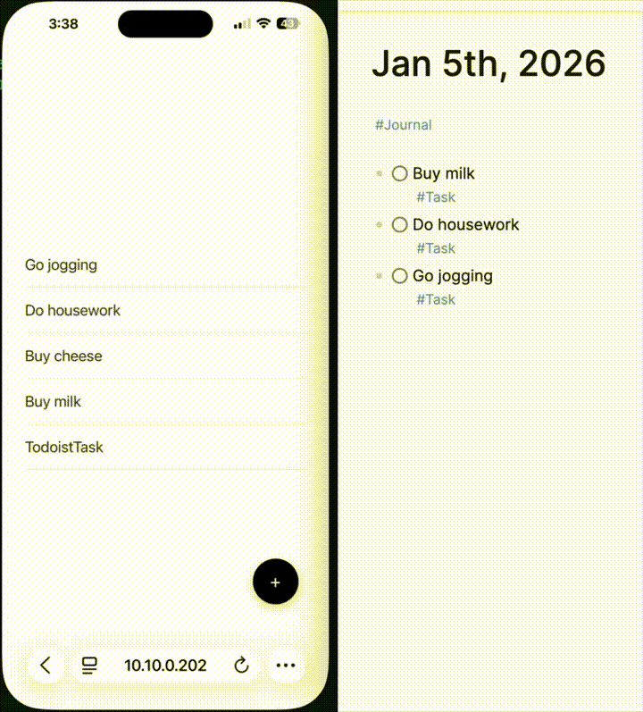

# Logseq Todo PWA

A lightweight, distraction-free Progressive Web App (PWA) designed to manage Logseq tasks on the go.

This project talks to your Logseq graph through a small local sidecar server that wraps the `logseq` CLI, allowing you to view and complete tasks without opening the full Logseq app. It features a "Focus Mode" to help you concentrate on one task at a time.

The app is **offline-first**: the last-fetched task list is cached in IndexedDB and renders even with no connection, and any changes you make offline (adding tasks, completing them, scheduling) are queued locally and replayed automatically when the sidecar is reachable again. Queued changes show as a count next to the sync dot.

## 🚀 Why build this?
* **Distraction-Free:** Looking at a massive task list in Logseq can be overwhelming. This app isolates tasks to help you focus.
* **Reliable Sync:** By connecting to a desktop instance hosted on a home server, sync issues are minimized. Changes update in real-time.
* **Speed:** A dedicated PWA is often faster and lighter than loading the full Logseq graph on mobile.

## ✨ Features
* **Focus Mode:** View one task at a time.
* **Real-time Sync:** Changes (completing a task) are reflected immediately in your Logseq graph.
* **Mobile Optimized:** Designed as a PWA; installable on iOS and Android for a native app-like experience.
* **Secure Access:** Designed to run behind a VPN (Tailscale) for secure remote access without exposing ports to the public internet.

## 🛠 Prerequisites
Before running the app, ensure you have the following setup:

1.  **Logseq Desktop** running on a generic machine (or a VM/Home Server).
2.  **Tailscale** (or another VPN) set up to allow remote access to that machine.
3.  **Node.js** or **Bun** installed on the machine hosting the PWA.

## ⚙️ Configuration
### 1. Install the Logseq CLI
The sidecar shells out to the `logseq` CLI, so it must be installed and able to open your DB-version graph on the host machine.

### 2. Setup the PWA
Clone the repository and install dependencies:

    git clone [https://github.com/benjypng/logseq-todo-pwa.git](https://github.com/benjypng/logseq-todo-pwa.git)
    cd logseq-todo-pwa
    npm install 
    # OR if using Bun
    bun install

### 3. Environment Variables
Create a `.env.development` file in the root directory (see `.env.example`):

    LOGSEQ_GRAPH=your_graph_name
    ALLOWED_HOSTS=

## 🏃‍♂️ Usage
### Running Locally
Run the sidecar and dev server together:

    bun run start

Or separately, with the host flag to expose the dev server to your local network/VPN:

    bun run sidecar
    bun run dev -- --host

Ensure the app is accessible by visiting `http://<YOUR_SERVER_IP>:5173` from another device on the same network.

### Running in Production
Build the app, then serve the static build and the sidecar API from a single Bun server on port 5175:

    bun run build
    bun run serve

`bun run serve` starts `sidecar/serve.ts`, which serves `dist/` (with an `index.html` fallback for client-side routes) and handles `/logseq-cli/*` API requests in the same process — no Vite involved. It reads `LOGSEQ_GRAPH` like the dev sidecar, and the port can be overridden with `PORT`. The PWA service worker only activates with the production build, so installed PWAs auto-update from this server.

### Accessing on Mobile (Tailscale)
1.  **Enable Tailscale** on your mobile device.
2.  Open your mobile browser and navigate to `http://<YOUR_TAILSCALE_IP>:5173`.
3.  **Install as PWA**:
    * **iOS:** Tap the "Share" button -> "Add to Home Screen".
    * **Android:** Tap the menu (three dots) -> "Install App" or "Add to Home Screen".

### (Optional) DNS Setup
For easier access, configure your router or local DNS to map a friendly name to your server IP.
* Example: Access via `http://logseq-tasks:5173` instead of the raw IP address.

## 📝 Query Logic
By default, the app pulls blocks that match specific criteria (e.g., tagged with `#Task` or explicitly marked as `TODO`). The Datascript queries live in `src/constants.ts`; the React Query hooks that consume them live in `src/hooks/use-tasks.ts`.

## 📄 License
[MIT](LICENSE)
